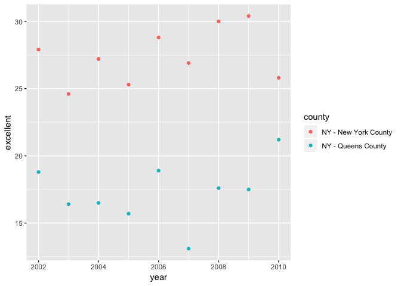

p8105\_hw2\_gwk2111
================
Zach Keefer
9/30/2018

Problem 1
---------

Read in data from the NYC transit subway entrance and exit data csv file, along with snaked variable names and entry converted from character to logical:

``` r
nyc_transit_data = read_csv(file = "./data/NYC_Transit_Subway_Entrance_And_Exit_Data.csv") %>% 
  janitor::clean_names() %>% 
  select(line, station_name, station_latitude, station_longitude, route1:route11, entrance_type, entry, vending, ada) %>% 
  mutate(entry = ifelse(entry == "YES", TRUE, FALSE))
```

    ## Parsed with column specification:
    ## cols(
    ##   .default = col_character(),
    ##   `Station Latitude` = col_double(),
    ##   `Station Longitude` = col_double(),
    ##   Route8 = col_integer(),
    ##   Route9 = col_integer(),
    ##   Route10 = col_integer(),
    ##   Route11 = col_integer(),
    ##   ADA = col_logical(),
    ##   `Free Crossover` = col_logical(),
    ##   `Entrance Latitude` = col_double(),
    ##   `Entrance Longitude` = col_double()
    ## )

    ## See spec(...) for full column specifications.

``` r
nyc_transit_data
```

    ## # A tibble: 1,868 x 19
    ##    line  station_name station_latitude station_longitu… route1 route2
    ##    <chr> <chr>                   <dbl>            <dbl> <chr>  <chr> 
    ##  1 4 Av… 25th St                  40.7            -74.0 R      <NA>  
    ##  2 4 Av… 25th St                  40.7            -74.0 R      <NA>  
    ##  3 4 Av… 36th St                  40.7            -74.0 N      R     
    ##  4 4 Av… 36th St                  40.7            -74.0 N      R     
    ##  5 4 Av… 36th St                  40.7            -74.0 N      R     
    ##  6 4 Av… 45th St                  40.6            -74.0 R      <NA>  
    ##  7 4 Av… 45th St                  40.6            -74.0 R      <NA>  
    ##  8 4 Av… 45th St                  40.6            -74.0 R      <NA>  
    ##  9 4 Av… 45th St                  40.6            -74.0 R      <NA>  
    ## 10 4 Av… 53rd St                  40.6            -74.0 R      <NA>  
    ## # ... with 1,858 more rows, and 13 more variables: route3 <chr>,
    ## #   route4 <chr>, route5 <chr>, route6 <chr>, route7 <chr>, route8 <int>,
    ## #   route9 <int>, route10 <int>, route11 <int>, entrance_type <chr>,
    ## #   entry <lgl>, vending <chr>, ada <lgl>

This dataset is NYC Transit data that contains information on the entrances and exits of MTA Subway stations. It has 15 character variables, two double variables, and two logical variables. The double variables refer to station latitude and longitude, while the character and logical variables are used to characterize each observation. There are 11 different character variables for route. Notable among the variables are line and station\_name which define a specifc station, as well as ada, which says whether a station is ADA compliant. To clean this data I read in the file, used janitor to make more usable variable names, selected the 19 variables as instructed and then changed the entry variable from character to logical. This dataset has 1,868 rows and 19 columns. As stated before, there are 11 variables to describe route with many observations left empty. As a result, before gathering, this data set is not tidy.

There are 465 distinct stations in the data set. 84 of these stations are ADA compliant. The proportion of entrance/exits that don't have vending that do allow entry is 0.3770492.

``` r
##This code gathers the data and makes route number qnd route name two distinct variable, as opposed to having 11 route variables.
nyc_transit_data_route_reformat = gather(nyc_transit_data, key = route_number, value = route_name, route1:route11)
```

There are 60 stations that serve the A train. Of the stations that serve the A train, 17 are ADA compliant.

Problem 2
---------

Mr. Trash Wheel Sheet

``` r
##Need to use this library in order to open the excel sheet
library(readxl)

mr_trash_wheel_data = 
  readxl::read_excel("./data/HealthyHarborWaterWheelTotals2018-7-28.xlsx", sheet = "Mr. Trash Wheel", range = "A2:N258") %>% 
  janitor::clean_names() %>% 
  filter(!is.na(dumpster)) %>% 
  mutate(sports_balls = as.integer(sports_balls)) 
```

2016 and 2017 Precipitation Data

``` r
##First reading in the 2 sheet, will combine them below
prcp_2016 = readxl::read_excel("./data/HealthyHarborWaterWheelTotals2018-7-28.xlsx", sheet = "2016 Precipitation", range = "A2:B14") %>% 
  janitor::clean_names() %>%
  mutate(year = 2016)

prcp_2017 = readxl::read_excel("./data/HealthyHarborWaterWheelTotals2018-7-28.xlsx", sheet = "2017 Precipitation", range = "A2:B14") %>% 
  janitor::clean_names() %>%
  filter(!is.na(total)) %>% 
  mutate(year = 2017)

prcp_2016_2017 = full_join(prcp_2016, prcp_2017) %>% 
  mutate(month = month.name[month])
```

    ## Joining, by = c("month", "total", "year")

The Mr. Trash Wheel Data set contains data regarding the amount and type of trash collected by the water-wheel vessel in Baltimore Harbor. The Precipitation in 2016 and 2017 data set contains data about the total percipitation by month in Baltimore harbor. The data in the data sets come from the Healthy Harbor Initiative. Variables of note in the Mr. Trash Wheel data set are dumpster, which is a unique identifier for each dumpster; weight\_tons, which describes the amount of trash each dumpster collects; and homes\_powered, which describes the amount of homes a dumpster's trash powers. Variables of note in the precipitaion data set are total, which is the total precipitation in a given month; as well as year and month. The Mr. Trash Wheel data set has 216 observations and the Preceipitation in 2016 and 2017 data set has 24observations.
Based on available data, the total percipitation in 2017 was32.93. The median number of sports balls in a dumpster in 2016 was 26.

Problem 3
---------

``` r
library(p8105.datasets)
library(plyr)
```

    ## -------------------------------------------------------------------------

    ## You have loaded plyr after dplyr - this is likely to cause problems.
    ## If you need functions from both plyr and dplyr, please load plyr first, then dplyr:
    ## library(plyr); library(dplyr)

    ## -------------------------------------------------------------------------

    ## 
    ## Attaching package: 'plyr'

    ## The following objects are masked from 'package:dplyr':
    ## 
    ##     arrange, count, desc, failwith, id, mutate, rename, summarise,
    ##     summarize

    ## The following object is masked from 'package:purrr':
    ## 
    ##     compact

``` r
brfss_data = brfss_smart2010 %>% 
  janitor::clean_names() %>%
  filter(topic == "Overall Health") %>% 
  select(-class, -topic, -question, -sample_size, -(confidence_limit_low:geo_location)) %>% 
  spread(key = response, value = data_value) %>% 
  janitor::clean_names() %>% 
  mutate(prop_exc_vgood = excellent + very_good) %>% 
  rename(c(locationabbr = "state",
         locationdesc = "county"))
```

404 51 11, 18, 21, 32, 52, 59, 47, 9, 27, 122, 27, 31, 14, 32, 25, 21, 38, 9, 45, 79, 90, 31, 34, 33, 25, 23, 18, 115, 18, 53, 48, 146, 43, 18, 65, 59, 40, 33, 59, 38, 63, 18, 26, 71, 50, 4, 48, 97, 9, 9, 22

``` r
filter(brfss_data, year == 2002) %>% 
  pull(excellent) %>% 
  median(excellent, na.rm = TRUE)
```

    ## [1] 23.6

``` r
filter(brfss_data, year == 2002) %>% 
  ggplot(aes(x = excellent)) +
  geom_histogram()
```

    ## `stat_bin()` using `bins = 30`. Pick better value with `binwidth`.

    ## Warning: Removed 2 rows containing non-finite values (stat_bin).


``` r
filter(brfss_data, county == "NY - Queens County" | county == "NY - New York County") %>% 
  ggplot(aes(x = year, y = excellent, color = county)) +
  geom_point()
```


